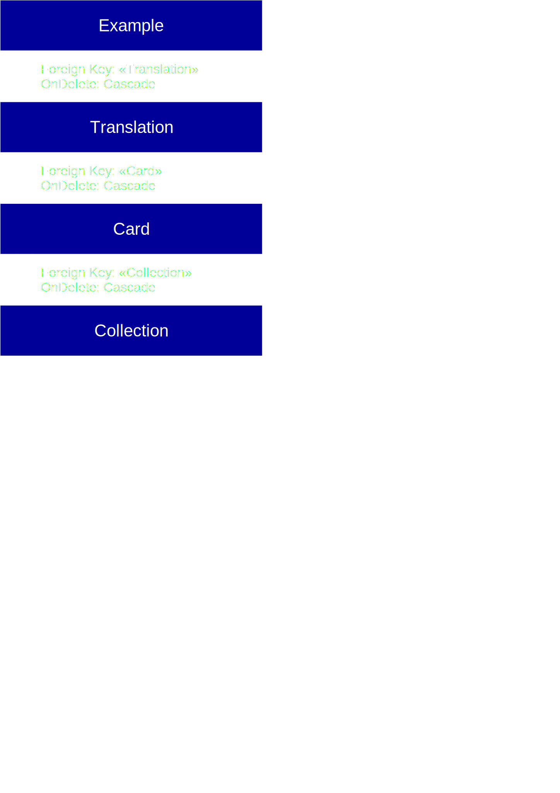

# Архитектура базы данных

## База данных полнофункцианльной версии приложения

База данных приложения построена с использованием СУБД PostgreSQL.

### Данные подключения (строка подключения: PostgreSQL)

- Вписать потом

## База данных для локального тестирования

Тестирование данного приложения производится при помощи СУБД SQLite

### Данные строки подключения (строка подключения: SQLite)

- Вписать потом

## Таблицы, содержащиеся в базе данных

Классы-модели для данных таблиц описаны в библиотеке классов "SimpleWordModels". Пространство имен: SimpleWordModels.

### Таблица Collections

Коллекции слов (карточек). Соответвующий класс: SimpleWordModels.Collection (Collection.cs).
| Field | Type | Decription | Requied | Other restrictions |
| --- | --- | --- | -- | -- |
|Id | Primary key (Integer) | Первичный ключ записи в таблице. При сооздании коллекции генерируется автоматически. | True| Неизменяем, уникален.|
| SourceLanguage | String | Язык слов и фраз, описанных в карточках коллекции.  | True | Соответвие стандарту ISO 639-3. |
| DestinationLanguage | String | Язык, на котором описаны переводы слов и фраз коллекции. | True | Соответвие стандарту ISO 639-3. |
| Name | String | Название коллекции. | True| Не более 200 симоволов. 
| Description | String | Описание коллекции. | True| Не более 1000 симоволов.  |
|Author | String | Автор коллекции. |  False | Не более 100 символов.
|LinkName | String | Строка-уникальный идентификатор. | True | Не более 30 символов. Может создержать только строчные латинские буквы (если в запросе содержатся заглавные, они преобразовываются в строчные), цифры и символ подчеркивания (ASCII-код 95).

### Таблица Cards

Слова и фразы, содержащиеся в коллекциях ("Карточки"). Соответвующий класс: SimpleWordModels.Card (Card.cs).
| Field | Type | Decription | Required | Other restrictions |
| --- | --- | --- | -- | -- |
| Id  | Primary key (Integer) | Первичный ключ записи в таблице. При сооздании коллекции генерируется автоматически. | True| Неизменяем, уникален.|
| Word | String | Слово или фраза на исходном языке| True | Не более 50 симоволов.
| Collection | Foreign key to collection | Коллекция, содержащая данную карточку. | True  |
| Comment | String | Комментарий автора коллекции к данной карточке |   False | Не более 500 симоволов.

### Таблица Translations

Возможные переводы слова или фразы соответвующей карточки. Соответвующий класс - SimpleWordModels.Translation (Translation.cs).

| Field | Type | Decription | Required | Other restrictions |
| --- | --- | --- | -- | -- |
| Id  | Primary key (Integer) | Первичный ключ записи в таблице. При сооздании объекта генерируется автоматически. | True| Неизменяем, уникален.|
| Card | Foreign key to word | Карточка, к которой относится перевод. | True |
| Value | String | Вариант перевода для соответвующего слова  | True | Не более 50 симоволов. |
| Comment | String | Комментарий автора коллекции к данному варианту перевода |   False | Не более 500 симоволов.

### Таблица Examples

Образцы использования слова или фразы в определённом значении на конкретных примерах. Соответвующий класс: SimpleWordModels.Example (Example.cs).

| Field | Type | Decription | Required | Other restrictions |
| --- | --- | --- | -- | -- |
| Id  | Primary key (Integer) | Первичный ключ записи в таблице. При сооздании объекта генерируется автоматически. | True| |
| Translation | Foreign key to translation | Перевод, соответвующий образцу | True | |
| Origin | String| Пример использования слова (на исходном языке) | True  | Не более 400 симоволов |
| ExampleTranslation | String | Перевод данного примера | True | Не более 400 симоволов |
| Comment | String | Комментарии автора коллекции к данному примеру |  False | Не более 500 симоволов |
| Source | String | Источник, откуда взят пример. |  False | Не более 200 симоволов

## Отношение между таблицами

## Многопоточность
Все таблицы должны быть защищены от одновременных изменений (ConcurrencyCheck)
